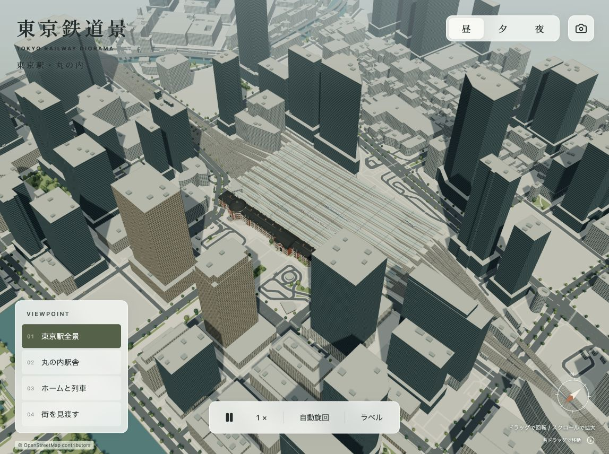
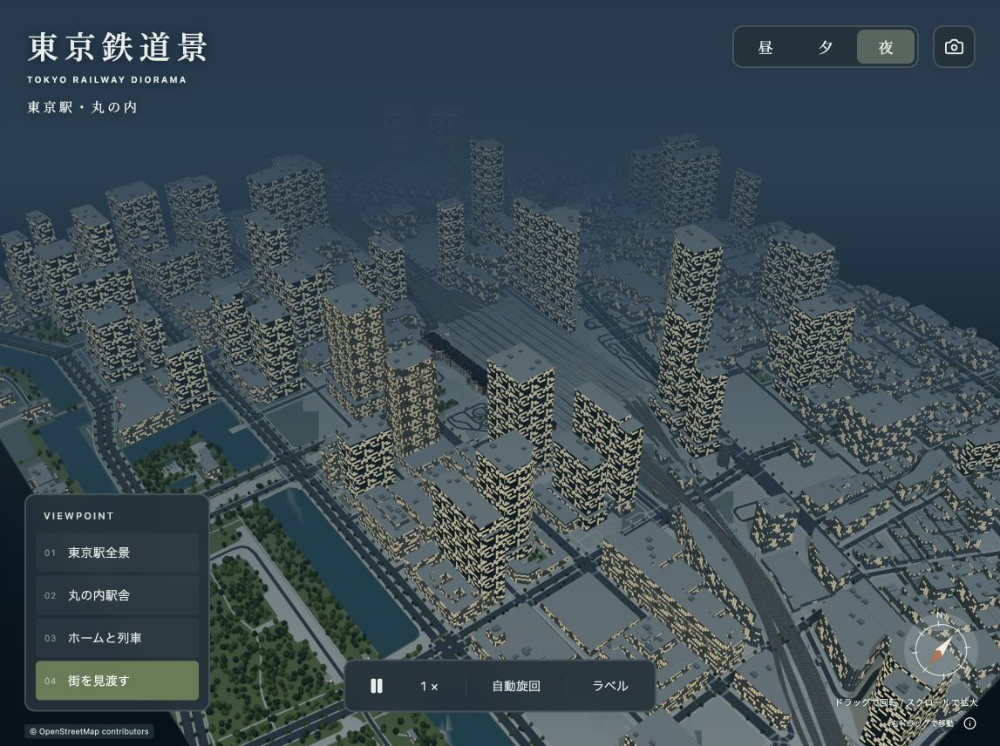

# 周辺道路・建物の実地図化 — 2026-09-05

Google Mapsをブラウザで開き、航空写真で東京駅の向き、丸の内の大きな街区、八重洲の細かい街区、南側で曲がる線路と道路、お堀を確認しました。そのうえで、描画の座標・輪郭はOpenStreetMapの公開データから生成しています。

## 変更

- 以前の規則的な道路と任意配置のビルを、実際の道路中心線と建物ポリゴンに置き換え。
- 約1.46 × 1.71 km。1,427個の建物ボリューム（低層部・高層部を含む形状数）、729区間の道路、195区間の線路。
- 中庭の穴、斜めの敷地、多角形、低層部と高層部の段差を保持。JPタワーの低層部、丸ビルの段差、国際フォーラムの細長い形状などを反映。
- お堀の輪郭に沿う水面と護岸、実際の緑地に沿う樹木、道路沿いの歩道、地図上の横断歩道を描画。
- 列車は接続する線路形状に沿って各車両が旋回。自動車も取り込んだ道路上を走行。
- 駅舎を駅の軸に合わせ、長さを約318 mに調整。近景と広域の視点を再調整。
- 常時表示とPNG書き出しにOpenStreetMapの帰属表記を追加。

## 再現範囲

高さの出典内訳は、OSMの高さ134件、階数から換算303件、一般推定981件、低層部推定1件、駅前の小建築の目視推定7件、東京ミッドタウン八重洲の公式情報1件です。OSMに高さがあっても精密な上部形状がない場合は、内側に縮めた形で補完しています。各形状のIDと出典をJSONに記録しています。

未登録の道路幅は車線数または道路分類から推定。外壁の窓・色、屋上設備、樹木、ホーム、架線、鉄道の高さ・運行は演出用の簡略化です。データの更新遅れ・欠落はあります。Googleの画像や3D素材をアプリに取り込んではいません。

## 検証

- `npm run build` 成功。地図データとThree.jsによる500 kB超のチャンク警告あり。
- データのID重複、輪郭の閉鎖、描画範囲、建物の高さ、道路・線路の頂点数を検証し通過。
- アプリ内ブラウザで全景、駅舎近景、広域・夜景を目視確認。ブラウザのエラー・警告ログなし。
- 近景時のUI表示で120 fpsを観測。端末や視点による性能保証ではありません。
- PNGプレビューは2007 × 1498 pxで生成され、地図の帰属表記も画像内に表示。

## 参考と出典

- [Google Maps：東京駅・丸の内の航空写真](https://www.google.com/maps/@35.6801,139.7638,17z/data=!3m1!1e3) — ブラウザで目視確認
- [OpenStreetMap](https://www.openstreetmap.org/copyright) — 道路・建物・水辺などの座標付きデータ、ODbL
- [東京ミッドタウン八重洲 施設概要](https://www.yaesu.tokyo-midtown.com/about/facilities) — タワー高さ240 m
- [日本郵政不動産 JPタワー](https://www.jp-re.japanpost.jp/properties/jptower.html) — 高層部と保存低層部の構成
- [Tokyo Station City](https://www.tokyostationcity.com/learning/station_building/) — 駅舎外観

[データライセンスと再生成手順](../DATA-LICENSE.md)
